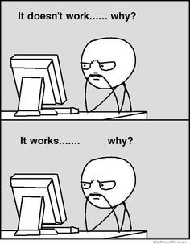

# Vitaly Shishou
**Trainee Front-end Developer**



## Contacts
* email: shishovip@yandex.ru
* phone: +375291151514
* github: [VitalyRK](https://github.com/VitalyRK)
* discord: VitalyRK#8345
* telegram: VitalyRK

## About me
Hi there! I’m frontend developer from Gomel Belarus. I have no work experience as a developer yet. But i’ve been studing and impruving my skills for almost half a year. I finished a couple of small online courses of Web Development and have a several projects in my portfolio written in HTML + CSS, a little JS. I have a lot of plans and dreams, and of course the main dream is to improve my technical skills and become a professional developer. And then, i'd like to create inviting, easy-to-use websites for consumers.

## Skills
* HTML
* CSS3
* JavaScript (Basic, DOM, JSON)
* Figma
* Photoshop (Basic)
* Git

## Code Example
Define a function that takes an integer argument and returns a logical value true or false depending on if the integer is a prime.
```
    function isPrime(num) {
        for(let i = 2; i <= Math.sqrt(num); i++) {
            if(num % i === 0) {
            return false;
            }
        }
    return num > 1
    }
```

## Experience
In 2009-2022, worked generally in another field - retail trade. Owned some mini shops, but in 2022 I closed my business and I started to be interested in front-end development.

[My projects can be viewed on **GitHub**.](https://github.com/VitalyRK?tab=repositories)
* [Landing page](https://vitalyrk.github.io/LayoutAdaptiveLanding/)
* [Order form](https://codepen.io/benemon/pen/XWYXpEW)
* [Promo-site (visiting card-site)](https://vitalyrk.github.io/ZlatonWebsite/)
* [CSS Text Gradient Generator](https://vitalyrk.github.io/GenerateTextGradient/)
## Education
* Francysk Skaryna Gomel State University, Geographer and ecologist, 2009
* Self-learning:
	* [Web-technologies: entry level](https://stepik.org/82108)
	* [Front-end Developer HTML, CSS and JavaScript](https://stepik.org/113402)
##  Language
* Russian - native speaker
* English (A2)
> I'm constantly studying English to reach an intermediate level